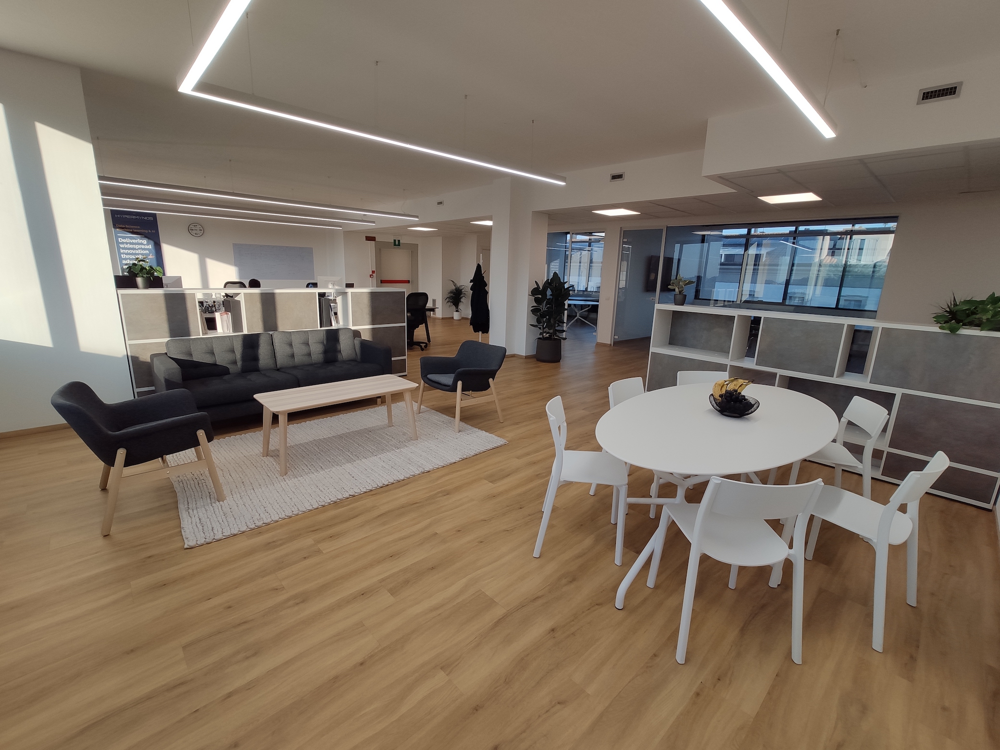

# Introduction

At Hypermynds we want everyone to feel part of a big family. We firmly believe
that work environment and relationships with the colleagues really matters and
are fundamental for your personal and professional growth. In addition, you will
likely spend more time with your colleagues than with your family and,
therefore, it is vital that the time spent at work is a positive time for you.

Our new office, inaugurated in the autumn of 2021, has been designed with this
philosophy in mind. We wanted to create a clean and relaxing environment, where
work and moments of relaxation and socialization can coexist.

```{r office, fig.align = 'center', echo=FALSE, out.width='100%'}

```

Moreover, in Hypermynds you will always find prepared colleagues ready to help
you throughout your career path. And we intend to train you to become the mentor
of those who will come next.
