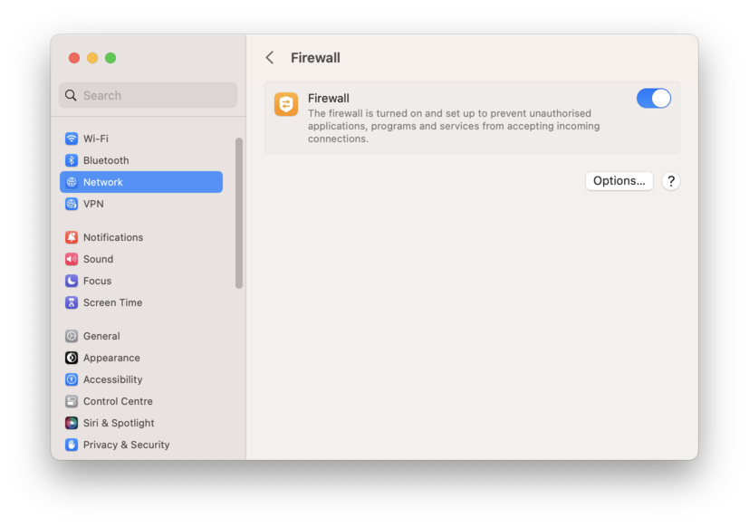
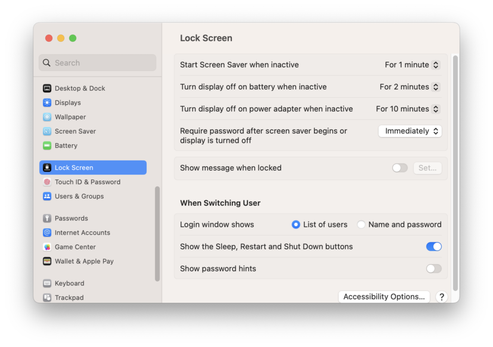
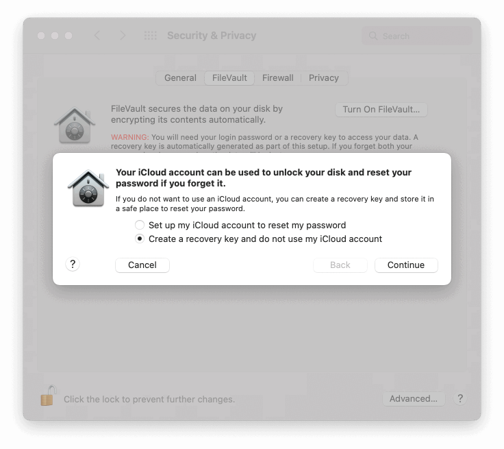
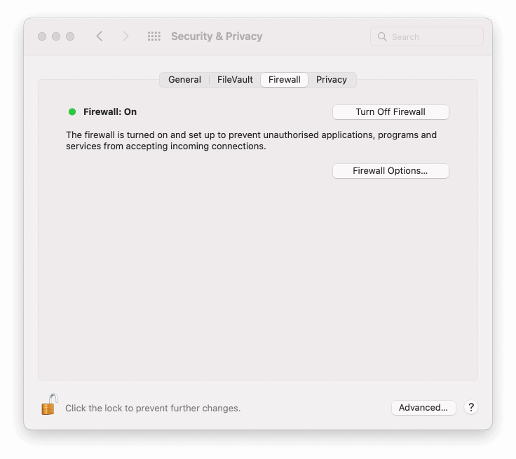
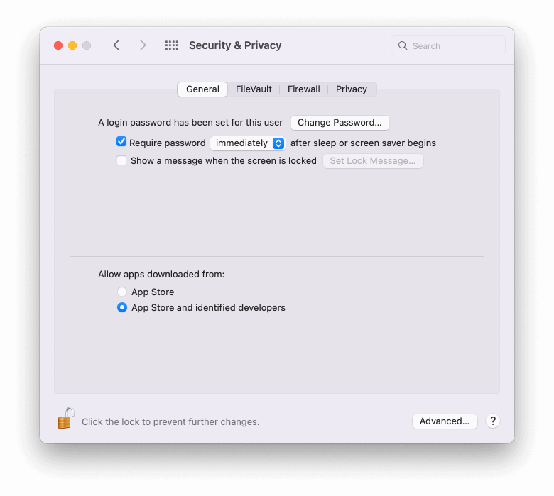
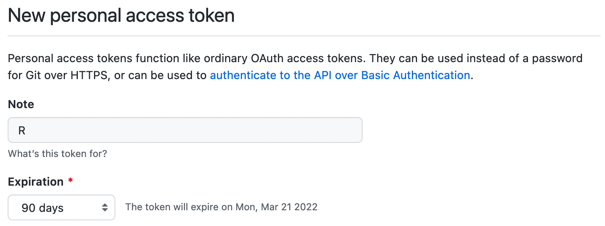
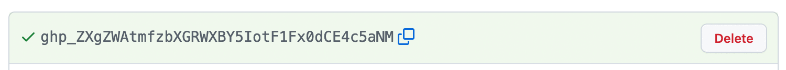

```{r panel-setup, include = FALSE}
xaringanExtra::use_panelset()
```

# Setting up your computer

## First-time Git setup

The first thing you should do before to use Git is set your identity, open the
terminal and execute the following commands:

```
> git config --global user.name "Your name here"
> git config --global user.email "your_email@hypermynds.com"
```

GitHub no longer accept the password authentication since August 2021, now a
SSH key must be used to access to your repositories.

* Open the terminal and execute the following command to create a new SSH key:
  ```
  > ssh-keygen -t ed25519 -C "your_email@hypermynds.com" -f ~/.ssh/github -N ""
  ```

* Open your SSH configuration file with the command `open ~/.ssh/config` (if it
  doesn't exist create it with the command `touch ~/.ssh/config`) and add the
  following lines:
  ```
  Host github.com
      AddKeysToAgent yes
      IdentitiesOnly yes
      IdentityFile ~/.ssh/github
  ```

* Copy your public key with the command `pbcopy < ~/.ssh/github.pub` and paste
  the key in the section *SSH and GPG keys* of your GitHub settings (click on
  *New SSH key* button).

## Security and privacy configuration {.panelset}

To mantain an high standard of security for personal laptop all the employees
must follow these guidelines:

### MacOS 13 Ventura {-}

* Computers must use hard drive encryption:
    1. choose Apple menu (&#63743;) then *System Settings…* and click *Privacy & Security*;
    2. scroll until the the *FileVault* section;
    3. click Turn On FileVault;
    4. choose to create a local recovery key and communicate the recovery key
       to your manager (do not use instant messaging or mail message).

* Firewall must be enabled:
    1. choose Apple menu (&#63743;) then *System Settings…* and click *Network*;
    2. click the *Firewall* menu;
    3. click on the toggle to turn on the firewall.

    ```{r ventura_firewall_enabled, fig.align = 'center', echo=FALSE, out.width='100%'}
    
    ```

* Disable automatic login and require the password when waking from sleep (if
  *FileVault* is activated then automatic login is already disabled):
    1. choose Apple menu (&#63743;) then *System Settings…* and click *Lock Screen*;
    2. select the option to require password *immediately* after screen saver
       begins or display is turned off.

    ```{r ventura_lock_screen, fig.align = 'center', echo=FALSE, out.width='100%'}
    
    ```

### MacOS 12 Monterey {-}

* Computers must use hard drive encryption:
    1. choose Apple menu (&#63743;) then *System Preferences* and click *Security & Privacy*;
    2. click the *FileVault* tab;
    3. click Turn On FileVault;
    4. choose to create a local recovery key and communicate the recovery key
       to your manager (do not use instant messaging or mail message).

    ```{r filevault_recovery_key, fig.align = 'center', echo=FALSE, out.width='100%'}
    
    ```

* Firewall must be enabled:
    1. choose Apple menu (&#63743;) then *System Preferences* and click *Security & Privacy*;
    2. click the *Firewall* tab;
    3. click *Turn On Firewall* button.

    ```{r monterey_firewall_enabled, fig.align = 'center', echo=FALSE, out.width='100%'}
    
    ```

* Disable automatic login and require the password when waking from sleep (if
  *FileVault* is activated then automatic login is already disabled):
    1. choose Apple menu (&#63743;) then *System Preferences* and click *Security & Privacy*;
    2. click the *General* tab;
    3. select the option to require password *immediately* after sleep or
       screen saver begin.

    ```{r security_general_tab, fig.align = 'center', echo=FALSE, out.width='100%'}
    
    ```

## How to install the software using Homebrew

[Homebrew](https://brew.sh/) is the easiest way to install the software and
keep it updated. To install Homebrew execute the following command in the
Terminal and follow the instructions:

```bash
/bin/bash -c "$(curl -fsSL https://raw.githubusercontent.com/Homebrew/install/HEAD/install.sh)"
```

Once that Homebrew has been installed close the Terminal and open it again, you
can check if everything is ok executing the command `brew --version`, you will
see something like this:

```
> brew --version
Homebrew 3.3.9
Homebrew/homebrew-core (git revision 8600fa3966f; last commit 2021-12-21)
Homebrew/homebrew-cask (git revision 17172f9d63; last commit 2021-12-21)
```

To complete the Homebrew setup you should install also
[`brew-cask-update`](https://github.com/buo/homebrew-cask-upgrade) executing
the command:

```bash
brew tap buo/cask-upgrade
```

### Keep everything updated

Homebrew handles the updates of installed softwares by itself, you don't need
to download or reinstall the software checking if a new version of some package
has been released. To keep everything updated you should follow the steps:

1. command `brew update` download the updated list of the packages provided by
   Homebrew;
2. command `brew outdated` gives you the list of outdated packages, so you can
   check if something will break your work;
3. command `brew upgrade` updates all the outdated packages installing the new
   available versions;
4. command `brew cu` updates all the cask packages (usually ignored by the
   `upgrade` command).

### Essential commands

`brew doctor`

:   Check your system for potential problems.

`brew info <package>`

:   Show summary of information about a package. 

`brew install [--cask] <package>`

:   Install a package or cask.

`brew list`

:   List all installed packages and casks.

`brew outdated`

:   List installed casks and packages that have an updated version available.

`brew reinstall [--cask] <package>`

:   Uninstall and then reinstall a package or cask.

`brew search <text>`

:   Perform a substring search of cask and package names.

`brew uninstall <package>`

:   Uninstall a package or cask.

`brew update`

:   Fetch the newest version of Homebrew and all packages.

`brew upgrade [<package>]`

:   Upgrade outdated casks and outdated packages. If cask or package are
specified, upgrade only the given cask or package.

## Setting up the R development environment

[R](https://www.r-project.org/) and
[RStudio](https://www.rstudio.com/products/rstudio/) can be installed using
Homebrew:

```
> brew install --cask r
...
> brew install --cask rstudio
...
```

RStudio is installed in your `/Applications` directory, to check if everything
has been setup correctly it is enough to open it.

### Set your Github Personal Access Token

To interact with private repositories or avoid the GitHub rate limits for
unauthenticated users you have to create a GitHub Personal Access Token:

Open R or RStudio and execute the following commands:

```r
install.packages('usethis')
usethis::create_github_token()
```

R will open your browser and redirect it to the page for creating the token
(probably it prompt for your password), set the name of the token to "R" and
the expiration time to 90 days (tokens without expiration are unsecure), leave
everything else untouched and click the button "Create token" at the and of the
page.

```{r github_create_new_pat, fig.align = 'center', echo=FALSE, out.width='100%'}

```

GitHub will show you the new created token (the ugly string with green
background), copy it and close the page.

```{r github_new_pat, fig.align = 'center', echo=FALSE, out.width='100%'}

```

Execute the following R command:

```r
usethis::edit_r_environ()
```

Now the file `~/.Renviron` will be opened with your preferred editor, now you
can add (or update) the line:

```
GITHUB_PAT=<PUT HERE THE GITHUB TOKEN AND NOT THESE MEANINGLESS WORDS>
```

For security reasons it is a good idea to change the permissions of
`~/.Renviron` executing the following command in the Terminal:

```bash
chmod 0600 ~/.Renviron
```

## Slack

[Slack](https://slack.com/) is the communication platform we use @Hypermynds to
chat, interact, manage projects and share thoughts about work and life.

To install Slack on your laptop you can use Homebrew:

```
> brew install --cask slack
```

Then you can access using your work email that you should have received from
your manager.

## Mail signature

Apple Mail allows you to create a custom HTML signature for your emails. Follow
the steps below to add a personalized HTML signature using the information from
the [HubSpot Email Signature Generator](https://www.hubspot.com/email-signature-generator/add-html-signature-mail-mac).

### Generate your HTML signature

Copy and paste in blank text file the HTML below, substituting the templates
with your own information.

```
<div style="font-family: Helvetica; font-size: 12px; color: rgb(0, 0, 0);">
  <div style='background: url("https://hm-app-logos.s3.eu-central-1.amazonaws.com/HM_pittogramma_turchese.png") no-repeat; background-size: 45px; padding: 0px 0px 50px 0px;'></div>
  <div style="font-size: 14px; font-weight: 600; color: #080F32;">
    {Name} {Surname}
  </div>
  <div style="color: #00869C; margin-bottom: 15px; text-transform: uppercase; font-size: 10px; letter-spacing: .05rem;">
    {Role}
  </div>
  <div style="font-weight: 600; color: #080f32">Hypermynds Srl</div>
  <div>Via Sempione, 11 | 20900 Monza | Italy</div>
  <div><a href="mailto:{email}">{email}</a> | {mobile} | <a href="http://hypermynds.com">hypermynds.com</a></div>
</div>
```

Your own role is displayed on [Hypermynds Directory](https://contacts.google.com/directory).

### Create a new signature on Apple Mail

1. In the Preferences window of Apple Mail, click on the **Signatures** tab.
2. On the left side, you'll see a list of your email accounts. Select the
account for which you want to add the HTML signature.
3. Click on the **+** button below the middle column to create a new signature.
Enter a name for your signature (e.g., "HM").
4. Add placeholder text to your signature. This text will be replaced by your
HTML signature, so don’t worry about the content.
5. Next, close the Settings window, and quit Apple Mail. It's important to
completely close Apple Mail. When you quit, your signature will be saved in your
system. This is a placeholder until you implement the HTML signature by
following the steps below.

### Paste your HTML signature

1. To install your HTML email signature, select **Go > Go to Folder** in the
Finder menu bar.
2. In the window, type `~/Library/Mail` and click the **Go** button.
3. In the new window that appears, click on the folder with the highest number
following the letter **V**. This folder holds the latest version (probably V10).
4. Choose **MailData** folder.
5. Choose **Signatures**.
6. In the Signatures folder, you’ll see a list of signature files. Look for the
file you just edited by examining the **Modified** date and open the newest file
that ends with `.mailsignature`.
7. Select the entire content of your pre-made HTML signature and copy the data.
Select the content starting with the `<body>` tag in your `.mailsignature` file
and replace it with your pre-made HTML data. Do not delete the data above
`<body>`. Save and close.
8. Right-click on the mail signature you just edited and choose **Get Info**.
9. Check the checkbox labeled **Locked** to prevent Apple Mail from overriding
your new HTML signature. Important: Do not omit this step, otherwise Apple Mail
will override your signature.

### Test your signature

Compose a new email to test your HTML signature. Send the email to yourself
to ensure the signature displays correctly.
