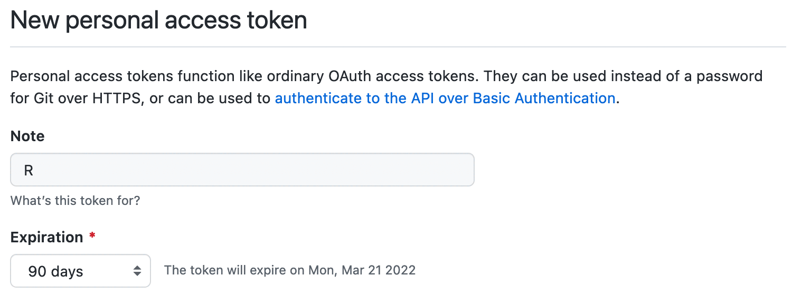
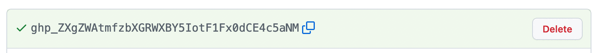

# Setting up your computer

Hypermynds provides company-managed Macs through Apple Business. Most security
settings and standard tools are now configured automatically.

This page explains what is prepared for you and what you still need to do
manually.

## Before your first day

Before delivery, Hypermynds prepares:

- your Google Workspace account;
- your managed Apple account tied to your company email;
- your Slack access;
- instructions to activate WireGuard access, when needed;
- your Mac with the correct company configuration.

Your company email must only be used with the Hypermynds managed Apple account,
not with a personal Apple account.

## First startup

At first boot:

1. connect the Mac to a reliable network;
2. complete the setup assistant without disconnecting;
3. create your local user if prompted;
4. if Apple sign-in is requested, use your managed company Apple account;
5. keep the Mac connected to the Internet while apps and configurations are downloaded.

Initial setup can continue for several minutes after the desktop appears.

## What is configured automatically

### HM People (all company Macs)

All company Macs receive the **HM People** baseline, including:

- password policy and automatic lock;
- macOS update settings;
- FileVault encryption with managed recovery key escrow;
- company Wi-Fi settings, where applicable;
- Bitwarden;
- Slack;
- WireGuard app.

### HM Tech (technical team only)

Technical team members also receive **HM Tech**, which installs:

- Homebrew;
- R;
- Cyberduck;
- Docker Desktop;
- pgAdmin 4;
- RStudio;
- Visual Studio Code.

Git is not installed by HM Tech. The system Git is used.

HM Tech Bootstrap is an internal automation package used to install and keep
aligned the standard Homebrew cask applications. It is not an end-user app.

## Homebrew: manual usage

Homebrew is installed automatically on technical Macs, but you still need to
know the standard commands to install additional approved tools and keep your
environment updated.

### Check installation

```bash
brew --version
brew doctor
```

### Install additional software

Use Homebrew for software required by your role and approved by company policy.

```bash
brew search <name>
brew info <package>
brew install <package>
brew install --cask <app>
```

### Keep packages updated

Run these commands regularly:

1. `brew update` to refresh package metadata.
2. `brew outdated` to review available updates.
3. `brew upgrade` to update installed formulae.
4. `brew upgrade --cask` to update installed GUI apps.

Useful commands:

- `brew list`
- `brew uninstall <package>`
- `brew reinstall <package>`

## Manual steps after automatic provisioning

### Account access and essentials

1. Sign in to Slack with your company account.
2. Create your Bitwarden account and then install the browser extension.
3. Verify access to required Google Workspace resources.

Bitwarden is self-service: if you do not have an account yet, create one using
your company email and follow internal onboarding instructions to organize your vault.

All company passwords, tokens, private keys, certificates, and secrets must be
stored in Bitwarden. Do not store secrets in browser storage, notes, email, or Slack.

### Google Drive

Google Drive for desktop is currently not deployed automatically.

Install it manually from the official Google website, then:

1. sign in with your company Google account;
2. use streaming mode by default unless your role requires otherwise;
3. verify access to your shared drives.

### Browser

Safari is available by default. Install Google Chrome only if your workflow requires it.

### VPN

If your role requires VPN access:

1. create and configure your personal WireGuard access following Operations/IT instructions;
2. activate the tunnel;
3. verify access to the internal target shared by Operations/IT;
4. never share your VPN credentials/profile or reuse them on unauthorized devices.

### Additional manual steps for technical team members

After the automatic setup, complete these checks:

1. launch Docker Desktop once and accept initial macOS permissions;
2. open Visual Studio Code and install only project-required extensions;
3. configure Git identity;
4. verify `git --version`;
5. open RStudio and confirm it uses the centrally installed R;
6. in existing R projects, restore dependencies with `renv` based on each project README;
7. verify access to assigned GitHub repositories.

Configure Git identity:

```bash
git config --global user.name "Your name"
git config --global user.email "your_email@hypermynds.com"
git --version
```

If macOS asks to install Apple Command Line Tools during first Git usage,
complete that installation.

## Git and GitHub access

Hypermynds uses GitHub with SSH authentication. Password-based Git operations
are not allowed.

### Create your GitHub account

GitHub account creation is self-service.

1. Create a GitHub account using your company email address.
2. Enable 2FA on the account.
3. Share your GitHub username with your manager or Operations/IT so repository access can be granted.

If you do not already have a GitHub SSH key on your Mac, create one:

```bash
ssh-keygen -t ed25519 -C "your_email@hypermynds.com" -f ~/.ssh/github -N ""
```

Configure SSH by creating or editing `~/.ssh/config`:

```text
Host github.com
    AddKeysToAgent yes
    UseKeychain yes
    IdentitiesOnly yes
    IdentityFile ~/.ssh/github
```

Copy the key and add it in GitHub under **Settings > SSH and GPG keys**:

```bash
pbcopy < ~/.ssh/github.pub
```

Verify connectivity:

```bash
ssh -T git@github.com
```

## GitHub Personal Access Token (for R and automation)

Some R workflows may require a GitHub Personal Access Token (PAT) to access
private repositories or avoid unauthenticated rate limits.

### Create the token

Open R or RStudio and run:

```r
install.packages("usethis")
usethis::create_github_token()
```

Use a clear token name (for example, `R`), set an expiration date, and grant
only the minimum required scopes.

```{r github_create_new_pat, fig.align = 'center', echo=FALSE, out.width='100%'}

```

```{r github_new_pat, fig.align = 'center', echo=FALSE, out.width='100%'}

```

### Store the token

Open your `~/.Renviron` file:

```r
usethis::edit_r_environ()
```

Add or update:

```text
GITHUB_PAT=ghp_xxxxxxxxxxxxxxxxxxxxxxxxxxxxx
```

Then lock file permissions:

```bash
chmod 0600 ~/.Renviron
```

Save the PAT in Bitwarden as well.

## Mail signature

Apple Mail allows you to create a custom HTML signature for your emails. Follow
the steps below to add a personalized HTML signature using the information from
the [HubSpot Email Signature Generator](https://www.hubspot.com/email-signature-generator/add-html-signature-mail-mac).

### Generate your HTML signature

Copy and paste in blank text file the HTML below, substituting the templates
with your own information.

```
<div style="font-family: Helvetica; font-size: 12px; color: rgb(0, 0, 0);">
  <div style='background: url("https://hm-app-logos.s3.eu-central-1.amazonaws.com/HM_pittogramma_turchese.png") no-repeat; background-size: 45px; padding: 0px 0px 50px 0px;'></div>
  <div style="font-size: 14px; font-weight: 600; color: #080F32;">
    {Name} {Surname}
  </div>
  <div style="color: #00869C; margin-bottom: 15px; text-transform: uppercase; font-size: 10px; letter-spacing: .05rem;">
    {Role}
  </div>
  <div style="font-weight: 600; color: #080f32">Hypermynds Srl</div>
  <div>Via Sempione, 11 | 20900 Monza | Italy</div>
  <div><a href="mailto:{email}">{email}</a> | {mobile} | <a href="http://hypermynds.com">hypermynds.com</a></div>
</div>
```

Your own role is displayed on [Hypermynds Directory](https://contacts.google.com/directory).

### Create a new signature on Apple Mail

1. In the Preferences window of Apple Mail, click on the **Signatures** tab.
2. On the left side, you'll see a list of your email accounts. Select the
account for which you want to add the HTML signature.
3. Click on the **+** button below the middle column to create a new signature.
Enter a name for your signature (e.g., "HM").
4. Add placeholder text to your signature. This text will be replaced by your
HTML signature, so don’t worry about the content.
5. Next, close the Settings window, and quit Apple Mail. It's important to
completely close Apple Mail. When you quit, your signature will be saved in your
system. This is a placeholder until you implement the HTML signature by
following the steps below.

### Paste your HTML signature

1. To install your HTML email signature, select **Go > Go to Folder** in the
Finder menu bar.
2. In the window, type `~/Library/Mail` and click the **Go** button.
3. In the new window that appears, click on the folder with the highest number
following the letter **V**. This folder holds the latest version (probably V10).
4. Choose **MailData** folder.
5. Choose **Signatures**.
6. In the Signatures folder, you’ll see a list of signature files. Look for the
file you just edited by examining the **Modified** date and open the newest file
that ends with `.mailsignature`.
7. Select the entire content of your pre-made HTML signature and copy the data.
Select the content starting with the `<body>` tag in your `.mailsignature` file
and replace it with your pre-made HTML data. Do not delete the data above
`<body>`. Save and close.
8. Right-click on the mail signature you just edited and choose **Get Info**.
9. Check the checkbox labeled **Locked** to prevent Apple Mail from overriding
your new HTML signature. Important: Do not omit this step, otherwise Apple Mail
will override your signature.

### Test your signature

Compose a new email to test your HTML signature. Send the email to yourself
to ensure the signature displays correctly.
